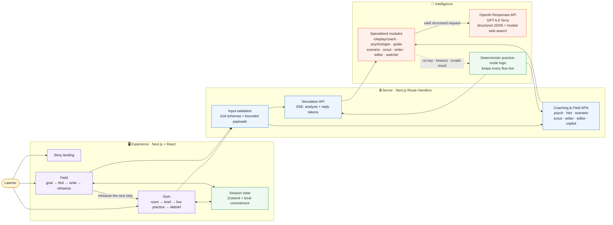
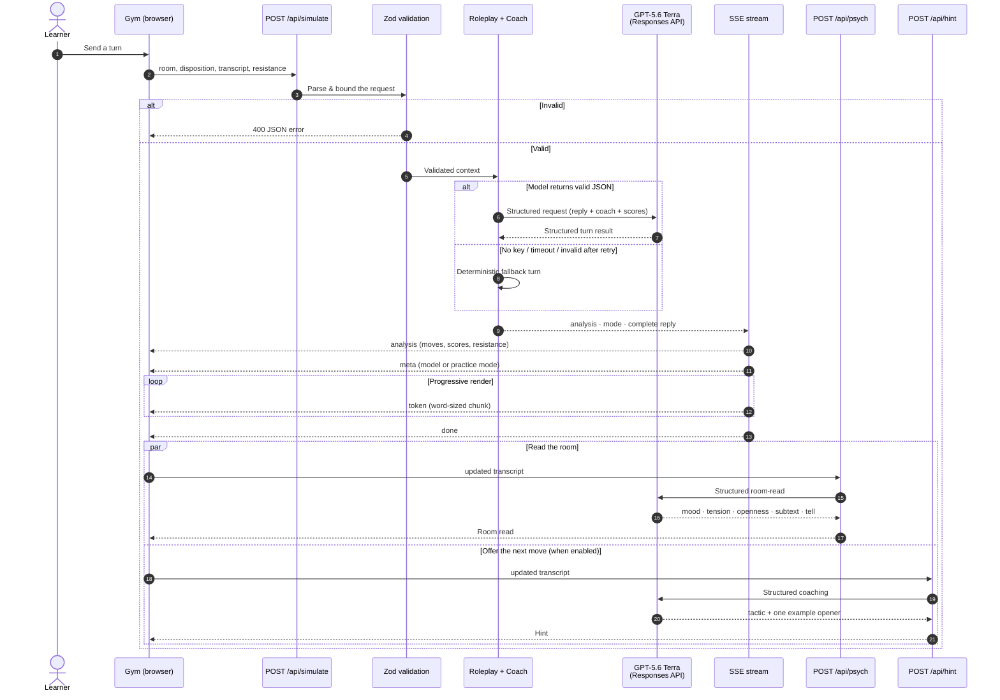

# IRL Gym

> **Rehearse. Perform. Land it.**

**IRL Gym is a flight simulator for the conversations that decide your life** — the salary negotiation, the hard piece of feedback, the boundary you never set, the ask you keep putting off. Step into a room, talk to an AI that pushes back like a real person, and watch a live read of every move you make. Then carry that momentum into the **Field**, where you find a real opportunity, write the outreach, and rehearse it before you act.

**The loop:** Find it → Write it → Rehearse it → Land it.

Built for the [OpenAI Build Week Challenge](https://openai.devpost.com/) — engineered with [OpenAI Codex](https://openai.com/codex/) and powered at runtime by the [OpenAI Responses API](https://developers.openai.com/api/docs/guides/latest-model) with **GPT-5.6 Terra**.

---

## Why it exists

School rewards knowing the answer. Real life rewards *saying it* — when a manager pushes back, when a recruiter names a number, when a teammate lets you down, when the room goes tense before a deadline.

You can ace every exam and still freeze the moment it counts. Not for lack of words, but because no one ever let you practice them under pressure. Self-help books hand you the theory; they can't give you the reps.

IRL Gym turns the moments that used to cost you — the raise you didn't ask for, the feedback you softened into nothing, the "yes" you gave when you meant "no" — into safe, repeatable practice. It's built for students and early-career builders who have to negotiate, give feedback, set boundaries, ask for help, and make career moves before the real conversation arrives.

## What you can practice

Real, high-stakes human skills — the ones that move careers and relationships:

- **Negotiation** — counter a low internship offer without folding on the first number.
- **Difficult feedback** — tell a teammate their part isn't done, and keep the relationship intact.
- **Asking** — request an extension, help, or time without over-explaining or apologizing.
- **Boundaries** — say no, and make it stick.
- **High-stakes judgment** — push back on shipping an AI product with a known jailbreak and a fairness regression.
- **Your own moment** — describe any conversation you're dreading and step into it seconds later.

## Product tour

| Surface | What the learner does | What the product returns |
| --- | --- | --- |
| **Story landing** (`/`) | Moves through a visual narrative from academic mastery to real-life pressure. | A clear case for why *practice*, not more advice, is the intervention. |
| **Gym** (`/gym`) | Chooses or invents a scenario, sets the room, and holds a live conversation. | An adaptive counterpart, move-by-move coaching, live resistance, a psychological room read, optional hints, and a debrief. |
| **Field** (`/field`) | Picks a goal, researches real opportunities, saves leads, drafts outreach, and sharpens it. | Source-linked leads, a focused first draft, line-level editing feedback, and a one-click handoff into the matching Gym scenario. |

### Built-in Gym scenarios

- Ask a professor for more time.
- Address a teammate who hasn't delivered.
- Negotiate an internship offer.
- Push back on shipping an AI product with a known jailbreak and fairness regression.
- Generate a custom one-on-one scenario from your own description.

Every room ships with a concrete objective, an in-character opening line, and several counterpart dispositions. Dial the intensity, turn on live coaching, ask for an in-the-moment hint, or make the room get harder every turn.

---

## Architecture

The browser never sees the model key. Every model call is made by a server-side route handler, validated in and out.



The Field's scout is the only feature that uses OpenAI's hosted web-search tool, and it surfaces only the source links returned in that response.

## One Gym turn, end to end

Each reply is generated as structured data first, validated, then streamed word-by-word over Server-Sent Events — so the UI shows your move analysis *before* the counterpart finishes speaking, and a reply never renders half-formed.



## What the AI actually does

Not one generic chat prompt. IRL Gym runs a set of small, specialized modules — each with a clear input and a typed, validated output.

| Module | Used by | Input | Structured output |
| --- | --- | --- | --- |
| **Roleplay + Coach** | Gym | Scenario, disposition, transcript, resistance | In-character reply, new resistance, one coach cue, 1–3 tagged moves, four scores |
| **Psychologist** | Gym | Scenario + transcript | Mood, tension, openness, subtext, and a behavioural tell |
| **Guide** | Gym | Scenario + transcript | One situational tactic and one natural opener — not a full script |
| **Scenario builder** | Gym | Free-form description | Person, role, context, objective, opening line, dispositions |
| **Scout** | Field | Goal + research query | 3–6 actionable leads, normalized against real web-search citations |
| **Writer** | Field | Goal + selected lead | A subject line and a 90–130 word outreach draft with one clear ask |
| **Editor** | Field | Draft text | Exact weak excerpts, fixes, four scores, and a rewrite |
| **Watcher** | Field | Goal, activity, saved leads, draft state, idle time | One concise nudge with an escalation level and action label |

### GPT-5.6 at runtime

The default model is **`gpt-5.6-terra`** (configured in `lib/ai/openai.ts`, overridable via `OPENAI_MODEL`) — the GPT-5.6 option that balances intelligence and cost. Every module runs through the **Responses API** for multi-turn roleplay, structured JSON output, and hosted web search, which [OpenAI recommends](https://developers.openai.com/api/docs/guides/latest-model) for reasoning, tool calling, and multi-turn workflows.

Practice turns are tuned for speed — low reasoning effort, low verbosity, a bounded output budget, and an 18-second server timeout — and every result is validated with Zod. A malformed output is retried once; if the model still can't respond, deterministic local logic takes over so the experience stays live.

## API surface

| Route | Purpose | Response |
| --- | --- | --- |
| `POST /api/simulate` | Runs the core Gym turn | SSE: `analysis` · `meta` · `token` · `done` |
| `POST /api/psych` | Reads the counterpart's emotional state and subtext | JSON |
| `POST /api/hint` | Suggests the learner's next tactical move | JSON |
| `POST /api/scenario` | Turns a free-form situation into a practice room | JSON |
| `POST /api/scout` | Finds live Field opportunities with citations | JSON |
| `POST /api/writer` | Drafts concise outreach for a selected lead | JSON |
| `POST /api/editor` | Critiques and rewrites an outreach draft | JSON |
| `POST /api/copilot` | Generates an activity-aware Field nudge | JSON |

Every route validates its request body, caps message and string lengths, and runs on the Node.js runtime so the OpenAI integration stays server-side.

## Tech stack

| Layer | Technology | Why it's here |
| --- | --- | --- |
| Framework | Next.js 16 (App Router) | File-based pages, server route handlers, production-ready builds |
| UI | React 19 + TypeScript | Interactive practice screens with typed state and safe contracts |
| Styling | Tailwind CSS 4 + design tokens · Inter · Playfair Display · JetBrains Mono | A warm editorial system that separates practice, feedback, and live room state |
| Client state | Zustand | Lightweight Field state — goal, results, saved leads, activity trail |
| Validation | Zod | Guards every browser-to-server request and every structured model result |
| LLM | OpenAI Responses API (server-side) | Structured JSON, chat context, and hosted web search without exposing secrets |
| Default model | GPT-5.6 Terra | Cost/quality-balanced GPT-5.6 for roleplay, coaching, writing, and research |
| Live feedback | Web Streams + Server-Sent Events | Analysis lands instantly; the reply renders progressively |
| Icons | Lucide React + small local primitives | Accessible UI without a heavy dependency |
| Deployment | Render (`render.yaml`) | Node web service with secret environment variables |

## Reliability & safety

- **Server-only credentials.** Only `OPENAI_API_KEY` on the server calls OpenAI — never a `NEXT_PUBLIC_` key.
- **Validated end to end.** Zod bounds transcripts, response fields, scores, and generated text before anything renders.
- **Always live.** Every module has deterministic practice-mode logic, so core flows keep working even without a key — and the UI labels practice mode honestly.
- **Never acts on your behalf.** IRL Gym doesn't send email or apply to anything; it rehearses and advises.
- **Transparent research.** Field leads carry the source URLs returned by web search, with a reminder to verify before sharing personal details.
- **Respectful by design.** Demeaning language is surfaced as a flagged move; the counterpart sets a calm boundary and invites a respectful restatement.
- **Privacy-minded requests.** Model calls use `store: false`.

---

## Built with Codex and GPT-5.6

Two distinct OpenAI technologies played two distinct roles.

### Codex engineered the build

OpenAI Codex served as the engineering collaborator: it inspected and repaired the Next.js starter, reorganized the architecture into typed modules, built the roleplay, coaching, and Field workflows, added Zod validation and deterministic fallbacks throughout, and verified the finished app with type checks, deterministic evaluations, and a production build.

Key decisions made along the way:

1. **Practice before performance** — keep the Gym-first voice instead of becoming a generic chatbot.
2. **One loop, not scattered tools** — wire Field outreach straight into a matching Gym room, so research becomes a rehearsed action.
3. **Structured outputs over brittle parsing** — make roleplay, coaching, editing, and room reads typed contracts, validated before use.
4. **Graceful by default** — deterministic fallbacks keep every flow usable when the model can't respond.
5. **Honest streaming** — stream a complete, validated reply over SSE rather than leaking partial, unvalidated text.

### GPT-5.6 powers the experience

At runtime, GPT-5.6 Terra gives the counterpart a grounded, scenario-specific voice; scores each message; reads emotional subtext; proposes a single next move; drafts and edits outreach; and researches Field leads with citations — all through the Responses API's structured-output mode, so results arrive in predictable shapes instead of free-form prose.

---

## Run locally

**Prerequisites:** Node.js 20+ and (optionally) an OpenAI API key. Without a key, the app runs in deterministic practice mode.

```bash
npm install
```

Create a local environment file:

```bash
# macOS / Linux
cp .env.example .env.local

# Windows PowerShell
Copy-Item .env.example .env.local
```

Set the server-only key:

```dotenv
OPENAI_API_KEY=your_key_here
# Optional — defaults to gpt-5.6-terra
OPENAI_MODEL=gpt-5.6-terra
```

Start the dev server:

```bash
npm run dev
```

Open [http://localhost:3000](http://localhost:3000).

**Useful routes:** `/` (story landing) · `/gym` (choose a room) · `/gym?room=offer` (jump straight into the offer negotiation) · `/field` (research + outreach).

## Verify

```bash
npm run typecheck
npm run eval
npm run build
```

`npm run eval` is a no-network, deterministic suite: it checks reply hygiene, flags hostile language, tests the outreach editor's heuristics, and confirms the Field watcher escalates its nudge correctly.

## Deploy on Render

1. Create a Render **Web Service** from this repository.
2. Add `OPENAI_API_KEY` as a secret environment variable.
3. Optionally set `OPENAI_MODEL=gpt-5.6-terra`.
4. Render uses `render.yaml` (`npm install && npm run build`, then `npm start`).

## Repository map

```text
app/
  page.tsx                 Story-led landing page
  gym/                     Gym practice experience
  field/                   Field research + outreach experience
  api/                     Validated Next.js route handlers
components/gym/            Radar, agent-flow, affect-grid, room-read visuals
lib/ai/openai.ts           Server-only Responses API client
lib/agents/                Specialized AI modules and fallbacks
lib/validation.ts          Request schemas + JSON parsing helper
lib/stream.ts              SSE response + progressive token helpers
lib/rooms.ts               Built-in Gym scenarios
lib/usecases.ts            Field missions and Gym handoffs
lib/store.ts               Zustand Field state
scripts/eval.ts            Deterministic fallback/heuristic checks
```

---

IRL Gym is built on one simple idea: **confidence isn't a personality trait — it's a record of reps.**
