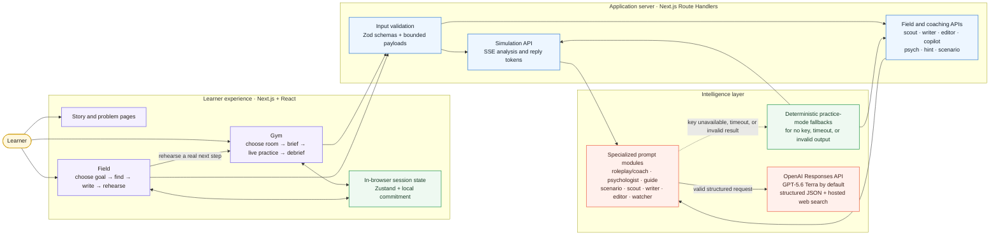
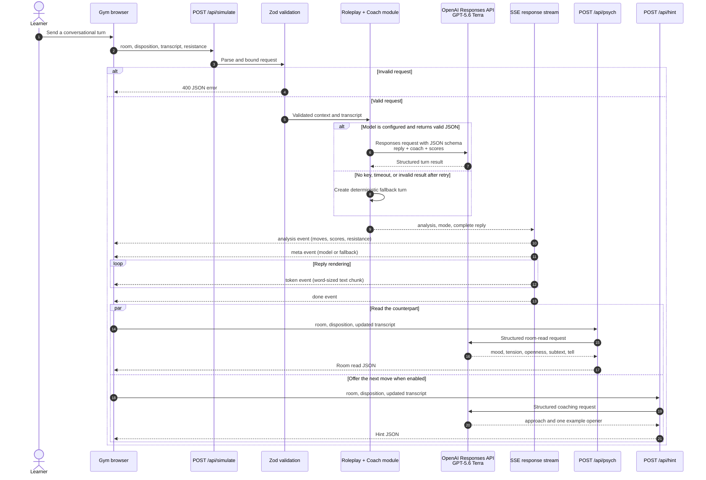

# IRL Gym

> **Rehearse. Perform. Land it.**

IRL Gym is a practice ground for the conversations and opportunities that shape real life. It gives a learner a realistic counterpart, live communication feedback, and a clear next rep—then carries that momentum into the **Field**, where they can find opportunities, write outreach, and rehearse before acting.

**Loop:** Find it -> Write it -> Rehearse it -> Land it.

Built for the [OpenAI Build Week Challenge](https://openai.devpost.com/), using [OpenAI Codex](https://openai.com/codex/) in the development workflow and the [OpenAI Responses API](https://developers.openai.com/api/docs/guides/latest-model) with **GPT-5.6 Terra** at runtime.

## Why it exists

School rewards knowing the answer. Real life rewards saying it when a manager pushes back, a recruiter gives a number, a teammate lets you down, or a deadline makes the room tense. Reading advice helps, but it does not create the muscle memory to make a clear ask under pressure.

IRL Gym turns those moments into low-stakes, repeatable reps. It is designed for students and early-career builders who need to negotiate, give feedback, ask for help, set boundaries, and make career moves before the real conversation arrives.

## Product tour

| Surface | What the learner does | What the product returns |
| --- | --- | --- |
| **Story landing** (/) | Moves through a visual narrative from academic mastery to real-life pressure. | A clear explanation of why practice—not more advice—is the intervention. |
| **Problem page** (/problem) | Sees the gap between rehearsing exams and rehearsing difficult human moments. | The framing for IRL Gym as an education product for real life. |
| **Gym** (/gym) | Chooses or creates a scenario, configures the room, and practices a live conversation. | An adaptive counterpart, move-by-move coaching, resistance, room read, optional hint, and debrief. |
| **Field** (/field) | Chooses a goal, researches opportunities, saves leads, drafts outreach, and edits it. | Source-linked leads, a focused first draft, editing feedback, and a handoff into the relevant Gym scenario. |

### Gym scenarios included

- Ask a professor for more time.
- Address a teammate who has not delivered.
- Negotiate an internship offer.
- Push back on shipping an AI product with a known jailbreak and fairness regression.
- Generate a custom one-on-one scenario from a learner's own description.

Every room has a concrete objective, an opening line, and several counterpart dispositions. The learner can set intensity, enable live coaching, ask for an in-the-moment hint, and gradually increase resistance.

## High-level architecture



The browser never receives OPENAI_API_KEY. All model calls are made by server-side route handlers. The Field scout is the only feature that uses OpenAI's hosted web-search tool; it only surfaces source links returned by that response.

## Low-level sequence: one Gym turn

The roleplay reply is generated as structured data first, then the completed reply is emitted over Server-Sent Events (SSE) in word-sized tokens. This keeps the UI responsive while allowing the app to show analysis before the full reply has rendered.



## What the AI actually does

This is not one generic chat prompt. The application uses small, specialized modules with clear inputs and typed outputs. They are independent prompt-and-validation components, not a claim that the app uses the OpenAI Agents SDK or autonomous agent swarms.

| Module | Used by | Input | Structured output |
| --- | --- | --- | --- |
| **Roleplay + Coach** | Gym | Scenario, disposition, transcript, current resistance. | In-character reply, new resistance, one coach cue, 1–3 moves, and four scores. |
| **Psychologist** | Gym | Scenario and transcript. | Mood, tension, openness, subtext, and a behavioural tell. |
| **Guide** | Gym | Scenario and transcript. | One situational tactic and one natural opener—not a full script. |
| **Scenario builder** | Gym | Free-form practice description. | Person, role, context, objective, opening, and dispositions. |
| **Scout** | Field | Learner goal and research query. | 3–6 actionable leads normalized against returned web-search citations. |
| **Writer** | Field | Goal and selected lead. | A short subject line and 90–130 word outreach draft with one clear ask. |
| **Editor** | Field | Draft text. | Exact weak excerpts, fixes, four scores, and a revised draft. |
| **Watcher** | Field | Goal, activity, saved leads, draft state, and idle time. | One concise nudge with an escalation level and action label. |

### GPT-5.6 at runtime

The default model is **gpt-5.6-terra**, configured in lib/ai/openai.ts and overridable with OPENAI_MODEL. The app chooses Terra because OpenAI positions it as the GPT-5.6 option that balances intelligence and cost; the server uses the Responses API for multi-turn roleplay, structured outputs, and hosted web search. [OpenAI's model guidance](https://developers.openai.com/api/docs/guides/latest-model) recommends the Responses API for reasoning, tool calling, and multi-turn workflows.

For latency-sensitive practice turns, requests use low reasoning effort, low text verbosity, a bounded output budget, and an 18-second server timeout. Model output is validated with Zod. A malformed output is retried once; a missing key, provider error, timeout, or second invalid result falls back to deterministic local logic so the product remains demoable.

## API surface

| Route | Purpose | Response |
| --- | --- | --- |
| POST /api/simulate | Runs the core Gym turn. | SSE: analysis, meta, token, done. |
| POST /api/psych | Reads the counterpart's emotional state and subtext. | JSON. |
| POST /api/hint | Suggests the learner's next tactical move. | JSON. |
| POST /api/scenario | Converts a free-form situation into a practice room. | JSON. |
| POST /api/scout | Searches for live Field opportunities with citations. | JSON. |
| POST /api/writer | Drafts concise outreach for a selected lead. | JSON. |
| POST /api/editor | Critiques and rewrites an outreach draft. | JSON. |
| POST /api/copilot | Generates an activity-aware Field nudge. | JSON. |

All routes validate request bodies before agent modules run. Conversation messages are capped, string lengths are bounded, and every dynamic route uses the Node.js runtime so the server-side OpenAI integration stays private.

## Tech stack

| Layer | Technology | Why it is here |
| --- | --- | --- |
| Application framework | Next.js 16 App Router | File-based pages, server-side route handlers, deployment-ready production build. |
| UI | React 19 + TypeScript | Interactive practice screens with typed state and safer component contracts. |
| Styling | Tailwind CSS 4, custom design tokens, Inter, Playfair Display, JetBrains Mono | A warm editorial visual system that differentiates practice, feedback, and live room state. |
| Client state | Zustand | Lightweight Field state for the active goal, results, saved leads, and activity trail. |
| Icons and components | Lucide React, small local UI primitives | Accessible feedback without a large component dependency. |
| Validation | Zod | Validates browser-to-server requests and every structured LLM result. |
| LLM integration | OpenAI Responses API via server-side fetch | Structured JSON, chat context, and hosted web search without exposing secrets. |
| Default LLM | GPT-5.6 Terra | Cost/quality-balanced GPT-5.6 model for roleplay, coaching, writing, and research. |
| Live feedback | Web Streams + Server-Sent Events | Sends analytics immediately and renders a reply progressively. |
| Quality checks | TypeScript, deterministic tsx evals, Next.js production build | Checks typed code, fallback logic, and production compilation. |
| Deployment | Render (render.yaml) | Node web-service configuration with secret environment variables. |

## Reliability, data, and safety boundaries

- **Server-only credentials:** only OPENAI_API_KEY on the server can call the OpenAI API. Never use a NEXT_PUBLIC_ prefix for it.
- **No silent failure:** each specialized module has a deterministic practice-mode fallback. The UI labels fallback simulation as practice mode rather than implying it is live AI.
- **Bounded inputs and outputs:** Zod validation and post-processing cap transcript length, response fields, scores, and generated text before rendering.
- **No database or accounts yet:** Field state is in memory and a Gym commitment is stored locally in the browser. The app does not send emails, apply for jobs, or take actions outside the app.
- **Research transparency:** real Field leads carry source URLs returned from hosted web search. Learners are reminded to verify an opportunity before sharing personal information.
- **Conversation guardrail:** demeaning language is surfaced as a flagged move; the counterpart is instructed to set a calm boundary and invite a respectful restatement.
- **API handling:** model requests use store: false. Review OpenAI's current platform data controls and your own deployment requirements before using sensitive information.

## Built with Codex and GPT-5.6

This repository is intentionally explicit about the two different roles OpenAI technology played.

### Codex accelerated the build

Codex was used as the engineering collaborator to inspect and repair the provided Next.js starter, reorganize the architecture, reconstruct broken agent code, complete the Field workflow, add typed validation and fallbacks, run browser smoke tests, and verify the finished app with type checks, deterministic evaluations, and a production build.

Key product decisions made during that process:

1. **Practice before performance:** preserve the original Gym-first voice instead of turning the app into a generic chatbot.
2. **One loop, not disconnected tools:** link Field outreach directly to a matching Gym room so research becomes a rehearsed action.
3. **Structured outputs over brittle text parsing:** make roleplay, coaching, editing, and room reads typed contracts, then validate them before the UI uses them.
4. **Graceful demos:** deterministic fallbacks keep every core flow usable if an API key is absent or the model cannot respond.
5. **Honest streaming:** stream a complete, validated reply through SSE for responsive UX rather than rendering partial, unvalidated model text.

### GPT-5.6 powers the product experience

At runtime, GPT-5.6 Terra gives the counterpart a grounded, scenario-specific voice; scores each learner message; reads emotional subtext; proposes a narrow next move; drafts and edits outreach; and researches Field leads with source citations. The integration uses the Responses API structured-output mode so these results arrive in predictable shapes rather than free-form prose.

## OpenAI Build Week submission notes

**Recommended track: Education.** IRL Gym advances learning by letting people rehearse the interpersonal skills classrooms rarely let them practice. It could also fit Apps for your life, but Education is the clearest match for the current product story.

The [Devpost challenge page](https://openai.devpost.com/) asks for a working project, a category, a description, a public demo video under three minutes that explains both Codex and GPT-5.6 usage, a repository URL, and the relevant Codex /feedback session ID. It also asks the repository README to include setup instructions, any required sample data, and clear evidence of where Codex and GPT-5.6 were used. For private repositories, the challenge page says to share access with testing@devpost.com and build-week-event@openai.com.

### Suggested demo-video flow

1. **Problem (0:00–0:20):** “Knowing what to say is not the same as being able to say it under pressure.”
2. **Gym (0:20–1:25):** Select *Negotiate your offer*, set a budget-conscious recruiter, make a counteroffer, and show resistance, move tags, the room read, and an actionable hint.
3. **Field (1:25–2:15):** Choose *Land a client*, search for a timely signal, save a lead, generate an outreach draft, review it, then click *Rehearse before sending*.
4. **OpenAI implementation (2:15–2:45):** Show the architecture diagram; explain Codex's build contribution and GPT-5.6 Terra's structured roleplay, coaching, writing, and research calls.
5. **Close (2:45–3:00):** “IRL Gym makes the moment before it is real a place where people can get reps.”

Useful references: [OpenAI Build Week](https://openai.com/build-week/), [Build Week challenge requirements](https://openai.devpost.com/), and [GPT-5.6 model guidance](https://developers.openai.com/api/docs/guides/latest-model).

## Run locally

### Prerequisites

- Node.js 20 or later recommended.
- An OpenAI API key to enable live GPT-5.6 responses and live Field research. The application still works in deterministic practice mode without one.

### Install and configure

```bash
npm install
```

Create a local environment file:

```bash
# macOS / Linux
cp .env.example .env.local

# Windows PowerShell
Copy-Item .env.example .env.local
```

Set the server-only key in .env.local:

```dotenv
OPENAI_API_KEY=your_key_here
# Optional. The app defaults to gpt-5.6-terra.
OPENAI_MODEL=gpt-5.6-terra
```

Start the development server:

```bash
npm run dev
```

Open [http://localhost:3000](http://localhost:3000).

### Useful routes

- / — story-led landing page.
- /problem — problem framing page.
- /gym — choose a Gym room.
- /gym?room=offer — direct offer-negotiation brief.
- /field — research opportunities and prepare outreach.

## Verify before submitting

```bash
npm run typecheck
npm run eval
npm run build
```

npm run eval is a no-network deterministic test suite. It checks reply hygiene, flags hostile language, tests outreach-editor heuristics, and confirms that the Field watcher escalates its nudge appropriately.

## Deploy on Render

1. Create a Render Web Service from this repository.
2. Add OPENAI_API_KEY as a secret environment variable.
3. Optionally set OPENAI_MODEL=gpt-5.6-terra.
4. Render uses render.yaml with npm install && npm run build and npm start.

## Repository map

```text
app/
  page.tsx                 Story-led landing page
  problem/page.tsx         Problem framing page
  gym/                     Gym practice experience
  field/                   Field research and outreach experience
  api/                     Validated Next.js route handlers
components/gym/            Radar, agent-flow, and room-read visualizations
lib/ai/openai.ts           Server-only Responses API client
lib/agents/                Specialized AI modules and fallbacks
lib/validation.ts          Request schemas and JSON parsing helper
lib/stream.ts              SSE response and progressive token helpers
lib/rooms.ts               Built-in Gym scenarios
lib/usecases.ts            Field missions and Gym handoffs
lib/store.ts               Zustand Field state
scripts/eval.ts            Deterministic fallback/heuristic checks
```

## Current limitations and next steps

- Add sign-in and encrypted server-side session history for learners who want to track progress across devices.
- Replace browser-only microphone support with an explicit, consent-based voice workflow.
- Add a send integration only after users can explicitly review, approve, and revoke outreach actions.
- Add scenario evaluation datasets and human feedback loops to benchmark coaching quality.
- Expand the Field scout with user-selected source preferences and stronger freshness controls.

---

IRL Gym is a prototype for a simple idea: **confidence is not a personality trait; it is a record of reps.**
